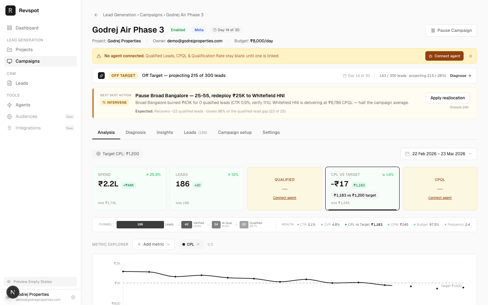
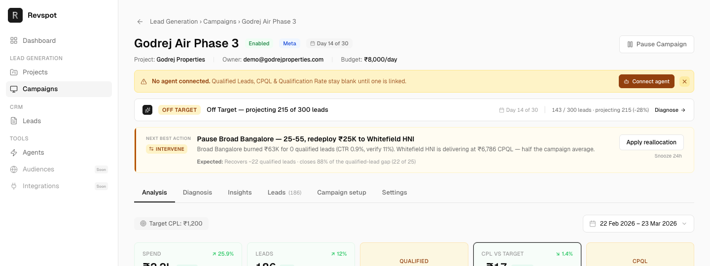
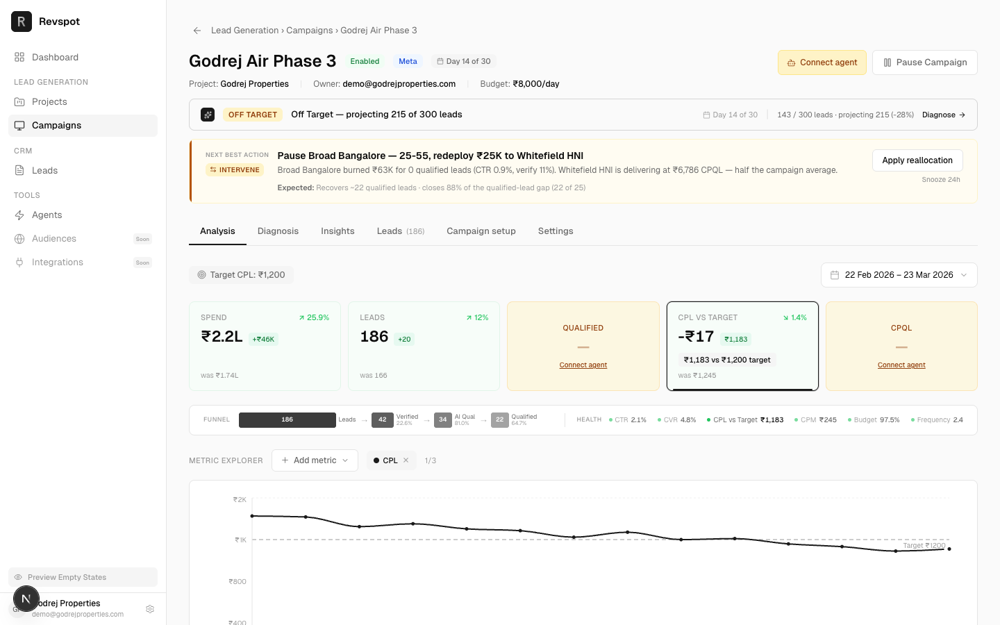
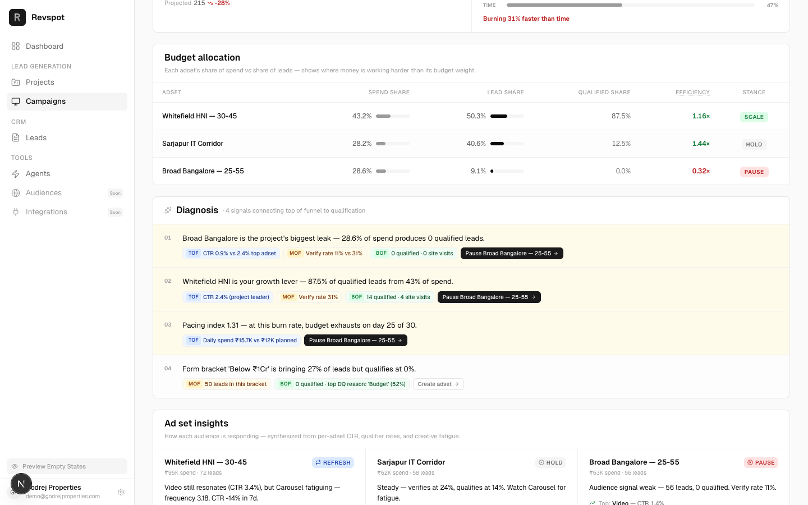
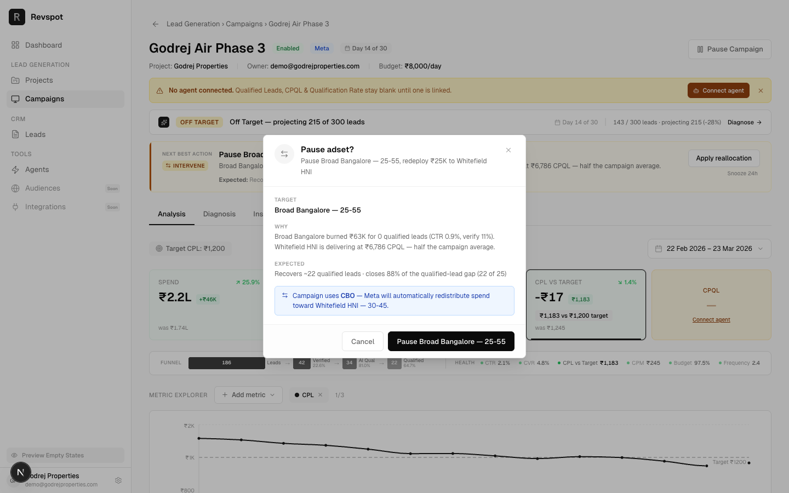
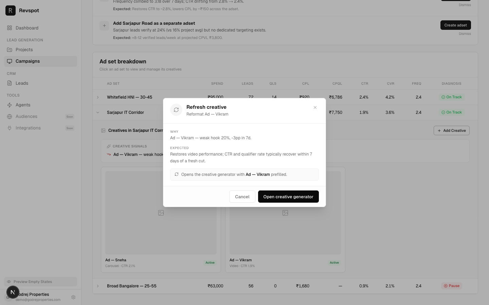
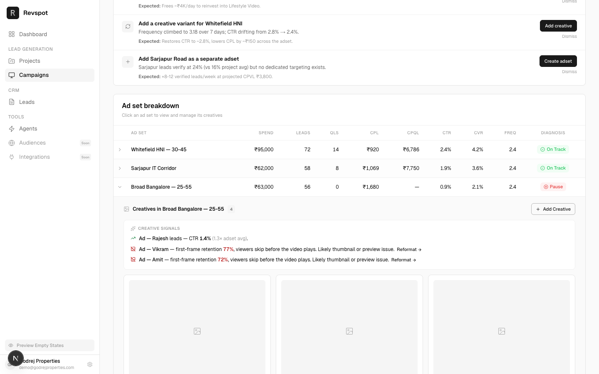
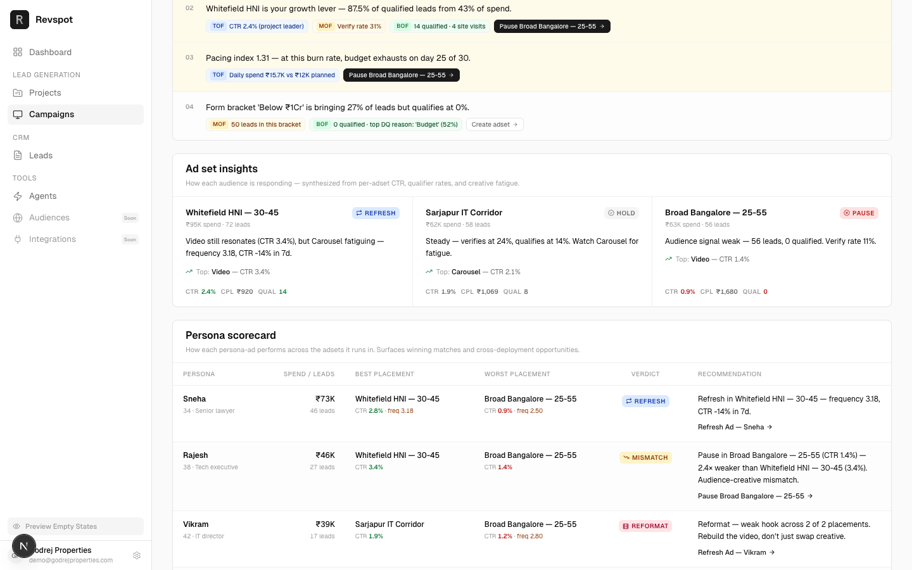
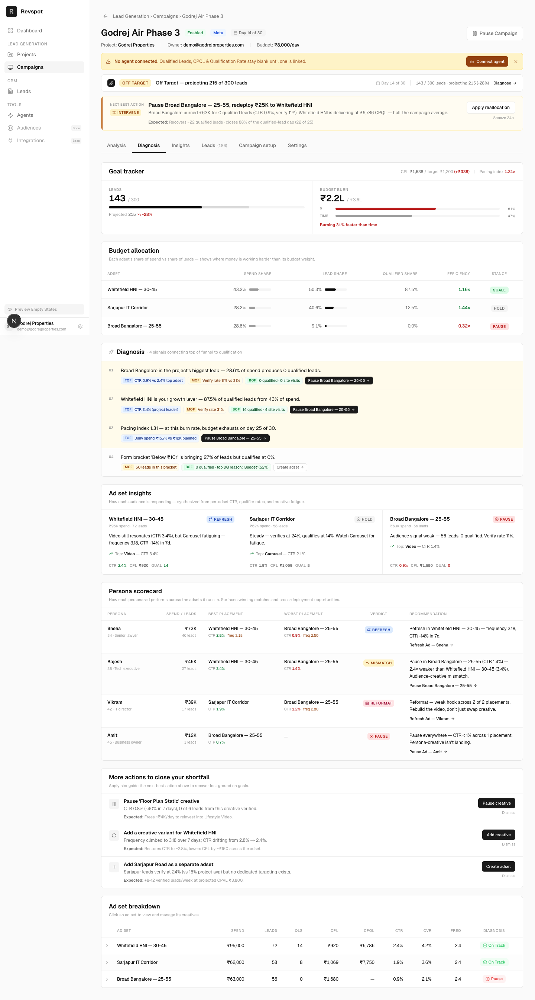

# PRD — Insight Nudges & Action Flow (Developer Handoff)

**Audience**: Engineering team building production
**Pairs with**: The MVP prototype in this repo (`/campaigns/camp-7` is the canonical demo)
**Reference docs**:
- Full spec: [`prd-insight-nudges.md`](./prd-insight-nudges.md)
- AI prompts: [`ai-prompts-action-flow.md`](./ai-prompts-action-flow.md)

---

## 1. What we're building

A diagnosis layer on the Campaign Detail page that turns observability into action. Every insight surfaced to the user (a status badge, a bullet, a creative signal) maps to a **verb-specific action flow** (Pause, Scale, Refresh, Add Creative, etc.) that completes in ≤2 confirmations. The diagnosis itself is produced by the AI orchestrator and consumed by this UI.



Out of scope here: building the AI orchestrator, real Meta API integration, audit/history UI.

## 2. Surfaces

All work lives within the campaign detail route.

| URL | What's there | Spec section |
|---|---|---|
| `/campaigns/[id]` (above tabs) | Status strip · NBA card · agent banner | §3, §4 |
| `/campaigns/[id]` → Diagnosis tab | Goal tracker · Budget allocation · Diagnosis bullets · Ad-set insights · Persona scorecard · More actions · Ad-set breakdown | §3, §5, §6 |

**Demo seed**: `camp-7` (Godrej Air Phase 3) — `budgetMode: "CBO"`, `agentConnected: false`, primaryGoal: "leads", off-target verdict.

The top section above the tabs (status strip · NBA · agent banner):



When the user dismisses the slim "No agent connected" banner, the `Connect agent` pill persists in the page header so they can act on it later:



---

## 3. Action-flow grammar

Every action emitted by the AI maps to one of four UI flows. The action object itself comes from the prompt (see §8).

| Flow | Verbs | UI |
|---|---|---|
| **A. Confirm-only** | `PAUSE`, `CONTINUE` | Single modal: target + reason + expected impact + Cancel/Confirm. |
| **B. Input + confirm** | `SCALE`, `SHIFT_BUDGET` | Modal with budget input (preset chips: +10% / +20% / +50% / custom %), validation, then confirm. |
| **C. Deep link** | `REFRESH`, `ADD_CREATIVE`, `ADD_ADSET` | Modal with confirm → opens Creative Generator (or Adset Wizard) prefilled with `target_entity`. |
| **D. No-modal** | `WAIT` | Inline snooze; persists 24h via `localStorage`. |

### CTA-label contract (enforce on every surface)

Always render `{verb_in_imperative} {target_entity}` — never generic.

✅ `Pause Broad Bangalore — 25-55` · `Scale Whitefield HNI` · `Refresh Ad — Sneha`
❌ `Apply` · `Apply reallocation` · `Drives action` · `Take action`

The helper [`getActionLabel(verb, target, budgetMode)`](../src/components/campaigns/actions/action-labels.ts) is the single source of truth — every consumer must use it. No string concatenation in components.

### Modal entry points (already wired in prototype)

Five surfaces open the same modal via `openActionFlow(action: RenderableAction)`:

1. **NBA card** — `Apply reallocation` button
2. **Diagnosis bullet** — verb-specific chip (e.g., "Pause Broad Bangalore →")
3. **More actions** — per-row CTA
4. **Persona scorecard** — per-row recommendation button
5. **Creative signals** — `Refresh →` / `Pause →` / `Reformat →` chips

The diagnosis bullets — note every chip reads as a verb-specific operation, not a generic "Drives action":



The two ends of the modal flow taxonomy — Confirm-only and Deep link:





### Acceptance criteria — Action flow

- [ ] Every action button on the page renders a verb-specific label produced by `getActionLabel`.
- [ ] Clicking any action button opens the central [`ActionFlowModal`](../src/components/campaigns/actions/action-flow-modal.tsx).
- [ ] Modal title, body, and CTA copy switch on `verb` (PAUSE → "Pause adset?", SCALE → budget input, etc.).
- [ ] Apply fires a toast naming the operation; modal closes; no error in console.
- [ ] Snooze on NBA persists across page reload (uses `localStorage`).

---

## 4. CBO / ABO awareness

`CampaignDetail` carries `budgetMode: "CBO" | "ABO"`. The prototype seed uses CBO.

### Verb validity

| Verb | CBO | ABO | Notes |
|---|---|---|---|
| `PAUSE` | ✅ | ✅ | Under CBO, mention "Meta will redistribute" in modal copy when paired with `redeploy_to`. |
| `SCALE` | ✅ (campaign-level) | ✅ (adset-level) | Modal label changes: "Campaign daily budget" vs "Adset daily budget". |
| `SHIFT_BUDGET` | ❌ — illegal | ✅ | Under CBO, [`resolveVerb`](../src/components/campaigns/actions/action-labels.ts) collapses this to `PAUSE` of the donor adset. |
| `INTERVENE` | ✅ but rewrites | ✅ | Under CBO, render as Confirm flow with title "Pause adset?" and a blue "CBO will redistribute" callout. |
| `REFRESH`, `ADD_CREATIVE`, `ADD_ADSET`, `CONTINUE`, `WAIT` | ✅ | ✅ | No mode-specific behavior. |

### Acceptance criteria — CBO/ABO

- [ ] When `campaign.budgetMode === "CBO"`, no `SHIFT_BUDGET` flow ever renders (defensive filter even if prompt emits one).
- [ ] CBO Pause modal shows the blue "Meta will redistribute toward {redeploy_to}" callout when `redeploy_to` is populated.
- [ ] CBO Scale modal label reads "Campaign daily budget" (not "Adset…").
- [ ] AI prompt receives `budget_mode` in input (see [`ai-prompts-action-flow.md`](./ai-prompts-action-flow.md) §1.1).

---

## 5. Video diagnosis signals

For `format === "Video"` creatives, we replace generic "fatigue" reasoning with one of four specific weaknesses. Each carries a distinct UI signal and a `REFRESH` action with copy that names the failing segment.

### New `CreativeMetric` fields (optional, only set when Video)

```ts
firstFrameRetention?: number;  // 0–1
hookRate?: number;              // 0–1
holdRate?: number;              // 0–1
playRate95?: number;            // 0–1
hookRateDelta7d?: number;       // pp
holdRateDelta7d?: number;       // pp
```

### Signal types (priority order)

| Signal | Trigger | Action chip | Modal copy emphasis |
|---|---|---|---|
| `VIDEO_THUMBNAIL_DROP` | `firstFrameRetention < 0.80` | Reformat | Re-cut thumbnail / preview frame |
| `VIDEO_WEAK_HOOK` | `hookRate < 0.25` OR `hookRateDelta7d ≤ -5` | Reformat | Rework first 3 seconds |
| `VIDEO_PACING_COLLAPSE` | `holdRate < 0.50` OR `holdRateDelta7d ≤ -8` | Reformat | Restructure middle pacing |
| `VIDEO_STORY_INCOMPLETE` | `playRate95 < 0.15` AND `holdRate ≥ 0.50` | Reformat | Rework CTA / final 25% |

When a creative qualifies for multiple, emit only the highest-priority one (thumbnail > hook > pacing > story). Generic CTR-based fatigue/weak signals must NOT fire on a creative that already has a video signal.

### Acceptance criteria — Video signals

- [ ] Each diagnosis bullet for a video creative includes ≥2 video metrics in its text (not just CTR).
- [ ] Reformat chip on a video signal opens the action-flow modal with a synthesized REFRESH action; the modal body cites the specific weakness reason.
- [ ] Demo path: `/campaigns/camp-7` → Diagnosis → expand "Broad Bangalore — 25-55" → Creative signals shows two `VIDEO_THUMBNAIL_DROP` entries (Vikram 77%, Amit 72%) with Reformat chips.



---

## 6. Persona scorecard

A summary card on the Diagnosis tab, one row per persona. Each persona-ad rolls up across all adsets it runs in, surfacing best/worst placement and a verdict.

### Verdicts (priority order)

| Verdict | Trigger | Recommended action |
|---|---|---|
| `pause` | Every active placement has CTR <1% OR (0 qualified across all placements with ≥30 leads) | `PAUSE` on `Ad — {persona.name}` |
| `reformat` | **Strict majority** (>50%) of video placements show the same `VIDEO_*` weakness | `REFRESH` on `Ad — {persona.name}` with "Reformat" CTA |
| `refresh` | Any placement is fatiguing (frequency ≥2.5 + ctrDelta ≤-10) | `REFRESH` |
| `mismatch` | Best/worst CTR gap ≥2× AND worst CTR <1.5% | `PAUSE` on the worst placement only (audience-specific) |
| `cross-deploy` | Best CTR ≥1.5× campaign avg AND persona is missing from at least one eligible adset | `ADD_CREATIVE` on the missing adset |
| `scale` | Best CTR ≥1.2× campaign avg AND ≥15 total leads | `SCALE` on the best placement |
| `hold` | Fallback | None |

### Acceptance criteria — Persona scorecard

- [ ] Each row renders persona name + age + role + spend + leads + best placement + worst placement + verdict pill + recommendation + verb-specific action button.
- [ ] Verdict rules fire deterministically — same input → same output. Demo: with current mock data, Vikram = Reformat, Rajesh = Mismatch, Sneha = Refresh, Amit = Pause.
- [ ] `Reformat` recommendation copy includes "{N} of {M} placements" and "Rebuild the video, don't just swap creative".



---

## 7. External resolution & state reconciliation (Phase 3 — to build)

Users will apply our recommendations on Meta directly without using our action flow. The system must detect this and not re-surface resolved actions.

### Required additions

**Schema** ([`diagnosis-payload.ts`](../src/lib/types/diagnosis-payload.ts)):

```ts
interface ActionSnapshot {
  entity_kind: "campaign" | "adset" | "creative";
  entity_id: string;            // stable Meta ID, NOT name
  before: { status?: "ACTIVE" | "PAUSED"; daily_budget?: number };
  expected_after: { status?: "ACTIVE" | "PAUSED"; daily_budget?: number };
  generated_at: string;         // ISO timestamp
}

type ActionResolution =
  | { state: "open" }
  | { state: "resolved-via-app"; applied_at: string; by: "user" | "auto" }
  | { state: "resolved-externally"; applied_at: string; detected_at: string }
  | { state: "resolved-partial"; applied_at: string; gap: string }
  | { state: "counter-action"; detected_at: string; observed: string }
  | { state: "stale"; reason: string }
  | { state: "snoozed"; until: string }
  | { state: "dismissed"; at: string };
```

Both `NextBestAction` and `SecondaryAction` get `snapshot: ActionSnapshot` and `resolution: ActionResolution`.

### Reconciler (runs on every diagnosis refresh)

For each `state: "open"` action, compare `snapshot.expected_after` to the current entity state from Meta:

| Diff | New resolution state |
|---|---|
| Match + we have an in-app log entry within ±2min | `resolved-via-app` |
| Match + no in-app log | `resolved-externally` |
| Status matches but other fields don't | `resolved-partial` (with `gap` describing the delta) |
| Opposite of `expected_after` | `counter-action` |
| Underlying metrics no longer support the recommendation | `stale` |
| No change | stays `open` |

### UI

- **Resolved (via-app/externally)** — collapsed into a "Recently resolved" rail at the bottom of the Diagnosis tab. Single-line items, optional click-to-expand drawer with full action history.
- **Resolved-partial** — stays in active stack, yellow chip "Partially applied — +10% vs recommended +20%", CTA changes to "Top up to +20%".
- **Counter-action** — stays in active stack, red chip "You did the opposite", inline `Why? [Tell us]` link feeding model feedback.
- **Stale** — quietly disappears on next refresh, audit-logged.

### Production data sources

- Poll Meta Insights API every 5 minutes for the focused campaign.
- App-originated actions log `action_id + applied_at + result_status` to backend.
- Cross-reference both to set resolution state.

### Acceptance criteria — Reconciliation

- [ ] No action with `resolution.state ∈ {resolved-*}` appears in the active stack.
- [ ] "Recently resolved" rail shows last 7 days, sorted desc by `applied_at`.
- [ ] `counter-action` items remain visible with red chip and feedback link; do NOT auto-dismiss.
- [ ] AI prompt receives `previous_recommendations` and does NOT re-emit a resolved action unless metrics have regressed.

---

## 8. AI prompts

The orchestrator's system prompt at [`ai-system-prompt.md`](./ai-system-prompt.md) and the campaign-diagnosis prompt at [`ai-prompt-campaign-diagnosis.md`](./ai-prompt-campaign-diagnosis.md) need updates to:

1. Accept `budget_mode`, video metric fields, and `previous_recommendations` as input.
2. Emit `cta_label` in the form `{verb} {target}` — never generic.
3. Use the four `VIDEO_*` sub-types when a video creative is involved.
4. Emit a Reformat-style action (one per persona, not per placement) when the same video weakness fires across the majority of a persona's placements.
5. Include `snapshot` on every action.

The full prompt diff (input fields, system-prompt patch, examples, validation checklist) lives in [`ai-prompts-action-flow.md`](./ai-prompts-action-flow.md). Apply that file as a patch.

---

## 9. Implementation tickets (suggested split)

| # | Title | Scope | Depends on |
|---|---|---|---|
| 1 | Schema: budgetMode + video metrics + ActionSnapshot/Resolution | Add types, extend mock data | — |
| 2 | Action-flow modal + hook | `ActionFlowModal`, `useActionFlow`, `getActionLabel` | 1 |
| 3 | Wire NBA + Diagnosis bullets to action flow | Replace generic CTAs with verb-specific labels | 2 |
| 4 | Wire More actions + Persona scorecard + Creative signals to action flow | Same plumbing | 2 |
| 5 | CBO/ABO awareness in modal copy + verb filter | Apply `resolveVerb` everywhere | 2 |
| 6 | Video signal branches in Creative signals | Four `VIDEO_*` sub-types | 1 |
| 7 | Reformat verdict in Persona scorecard | Strict-majority rule | 1, 6 |
| 8 | Reconciliation + Recently-resolved rail | New surface, new reconciler | 1 |
| 9 | AI prompt updates | Apply [`ai-prompts-action-flow.md`](./ai-prompts-action-flow.md) | — (parallel) |
| 10 | Snooze persistence (localStorage) | `${campaign_id}:${nudge_key}` keys, 24h TTL | 2 |

Tickets 1–7 are already implemented in the prototype — use the prototype source as the production-quality reference (file paths in §10). Tickets 8–10 are not yet built.

---

## 10. Reference files in the prototype

| Concern | File |
|---|---|
| Action flow primitives | [`actions/use-action-flow.ts`](../src/components/campaigns/actions/use-action-flow.ts), [`actions/action-labels.ts`](../src/components/campaigns/actions/action-labels.ts), [`actions/action-flow-modal.tsx`](../src/components/campaigns/actions/action-flow-modal.tsx) |
| Page-level wiring + toast | [`app/(app)/campaigns/[id]/page.tsx`](../src/app/(app)/campaigns/[id]/page.tsx) |
| Diagnosis tab orchestration | [`campaigns/diagnosis-tab.tsx`](../src/components/campaigns/diagnosis-tab.tsx) |
| NBA card | [`diagnosis/next-best-action.tsx`](../src/components/campaigns/diagnosis/next-best-action.tsx) |
| Diagnosis bullets | [`diagnosis/diagnosis-bullets.tsx`](../src/components/campaigns/diagnosis/diagnosis-bullets.tsx) |
| Ad-set insights | [`diagnosis/ad-set-insights.tsx`](../src/components/campaigns/diagnosis/ad-set-insights.tsx) |
| Persona scorecard (with Reformat) | [`diagnosis/persona-scorecard.tsx`](../src/components/campaigns/diagnosis/persona-scorecard.tsx) |
| More actions | [`diagnosis/more-actions.tsx`](../src/components/campaigns/diagnosis/more-actions.tsx) |
| Creative signals (with VIDEO_*) | [`diagnosis/creative-signals.tsx`](../src/components/campaigns/diagnosis/creative-signals.tsx) |
| Status strip | [`diagnosis/status-strip.tsx`](../src/components/campaigns/diagnosis/status-strip.tsx) |
| Schema | [`lib/types/diagnosis-payload.ts`](../src/lib/types/diagnosis-payload.ts), [`lib/campaign-data.ts`](../src/lib/campaign-data.ts) |
| Mock diagnosis payload | [`lib/diagnosis-data.ts`](../src/lib/diagnosis-data.ts) |

---

## 11. Screenshot index

Static images at [`docs/images/`](./images/) — captured by [`scripts/capture-prd-screenshots.ts`](../scripts/capture-prd-screenshots.ts) against the running prototype. Re-run `npx tsx scripts/capture-prd-screenshots.ts` (with the dev server live on `:3000`) to refresh.

| # | File | State | How to reproduce live |
|---|---|---|---|
| 1 | [`01-home-default.png`](./images/01-home-default.png) | Campaign Detail home, banner visible | Land on `/campaigns/camp-7` |
| 2 | [`02-banner-dismissed.png`](./images/02-banner-dismissed.png) | Slim banner dismissed; "Connect agent" pill in header | Click × on the agent banner |
| 3 | [`03-status-strip-nba.png`](./images/03-status-strip-nba.png) | Status strip + NBA card focus | Top section of `/campaigns/camp-7` |
| 4 | [`04-modal-confirm-cbo.png`](./images/04-modal-confirm-cbo.png) | Action-flow modal — Confirm flow with CBO callout | Click `Apply reallocation` |
| 5 | *(missing — `05-modal-scale-cbo.png`)* | Action-flow modal — Scale flow under CBO | Capture once a `SCALE` action exists in real LLM output (current mock has none); save to `docs/images/05-modal-scale-cbo.png` |
| 6 | [`06-modal-deeplink-refresh.png`](./images/06-modal-deeplink-refresh.png) | Action-flow modal — Refresh deeplink with persona prefilled | Diagnosis → expand Sarjapur → click `Reformat` chip |
| 7 | [`07-diagnosis-tab.png`](./images/07-diagnosis-tab.png) | Diagnosis tab full page | Click `Diagnosis` tab |
| 8 | [`08-persona-scorecard.png`](./images/08-persona-scorecard.png) | Persona scorecard with all 4 verdicts | Diagnosis tab → scroll to Persona scorecard |
| 9 | [`09-creative-signals-video.png`](./images/09-creative-signals-video.png) | Creative signals with two `VIDEO_THUMBNAIL_DROP` entries | Diagnosis tab → expand "Broad Bangalore — 25-55" |
| 10 | [`10-diagnosis-bullets.png`](./images/10-diagnosis-bullets.png) | Verb-specific Diagnosis bullet chips | Diagnosis tab → Diagnosis card |

The full Diagnosis tab in one frame:



---

## 12. Out of scope for this delivery

- Real Meta API integration (mocked end-to-end)
- Recently-resolved rail audit drawer (deeper history view)
- Trust indicator UI ("Last 5 recommendations improved CPL by X%") — telemetry exists per §7, the surface comes later
- Video performance card (proposed in long PRD §9.1, post-MVP)

## 13. Open questions

These are flagged in the long PRD §13 + §14.10 and need a product call before build:

1. Snooze granularity — per-NBA or per-campaign? **Recommend**: per-action.
2. Multi-step action confirm — combined or sequential modal? **Recommend**: combined.
3. CBO `SCALE` default delta — **Recommend**: +20%.
4. Resolution detection lag tolerance — **Recommend**: 5 min poll for focused campaign.
5. Counter-action escalation — silent down-rank or visible trust indicator? **Recommend**: visible.
